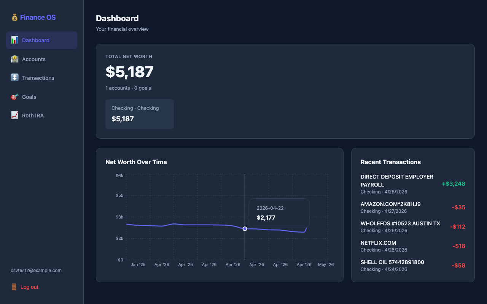
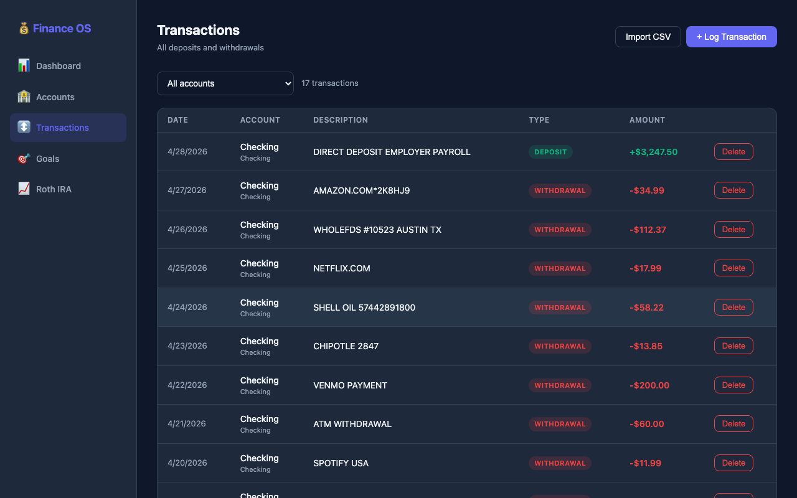
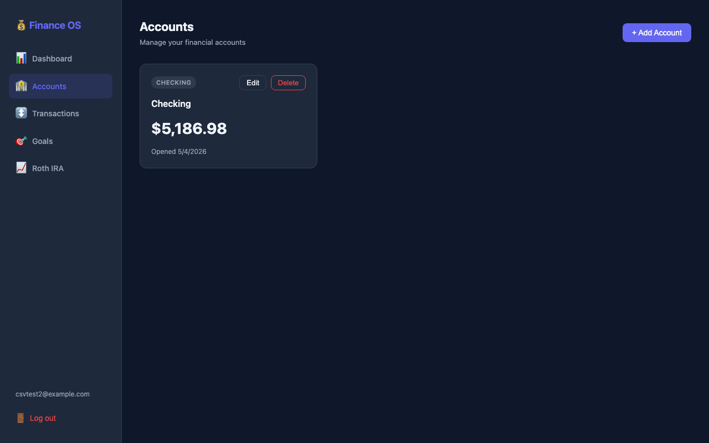
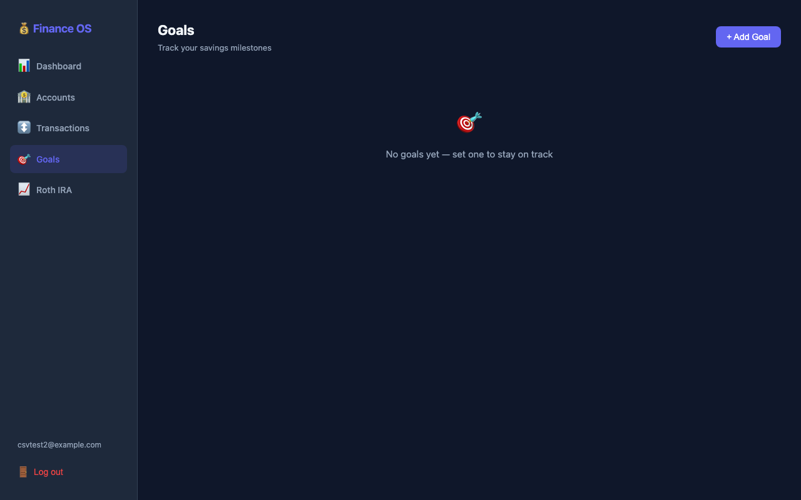

# Finance OS

A self-hosted personal finance tracker. Your data stays on your machine — no third-party sync, no bank credentials sent anywhere, no subscription required.



## Features

- **Net worth tracking** — see all accounts and your balance over time
- **CSV import** — drag and drop exports from Chase, Bank of America, Wells Fargo, or any bank (auto-detects columns)
- **Transaction history** — filter by account, log deposits and withdrawals
- **Savings goals** — set targets and track progress
- **Roth IRA tracker** — contribution limits and allocation breakdown
- **Secure auth** — bcrypt passwords, JWT tokens, rate limiting, no data ever leaves your server

## Screenshots

### Transactions


### Accounts


### Goals


## Getting started

### Docker (recommended)

```bash
git clone https://github.com/aiden202023/finance-os.git
cd finance-os

cp .env.example .env
# Edit .env and set SECRET_KEY (or let the next command generate one)
echo "SECRET_KEY=$(python3 -c 'import secrets; print(secrets.token_hex(32))')" >> .env

docker compose up --build
```

Open [http://localhost:5173](http://localhost:5173) and create an account. Data is stored in a Docker volume and persists across restarts.

### Run locally (without Docker)

**Requirements:** Python 3.11+, Node 18+

```bash
git clone https://github.com/aiden202023/finance-os.git
cd finance-os

# Backend
cd backend
python3 -m venv .venv && source .venv/bin/activate
pip install -r requirements.txt
echo "SECRET_KEY=$(python3 -c 'import secrets; print(secrets.token_hex(32))')" > .env
cd ..

# Install frontend deps
cd frontend && npm install && cd ..

# Start both servers
bash start.sh
```

Open [http://localhost:5173](http://localhost:5173) and create an account.

### Try it with sample data

To see the app fully populated without entering anything manually:

```bash
cd backend
python3 seed.py
```

This creates a demo account (`demo@example.com` / `Demo1234!`) with 4 accounts, 3 months of realistic transactions, savings goals, and Roth IRA data.

## CSV import

Export transactions from your bank and drag the file into the Import CSV modal on the Transactions page. Supported formats:

| Bank | Export location |
|------|----------------|
| Chase | Account activity → Download → CSV |
| Bank of America | Accounts → Download → CSV Format |
| Wells Fargo | Account Activity → Download → Spreadsheet (CSV) |
| Any bank | Works as long as the file has date, amount, and description columns |

## Stack

- **Backend** — FastAPI, SQLAlchemy, SQLite, bcrypt, python-jose
- **Frontend** — React, Vite, Recharts, Axios

## License

MIT
